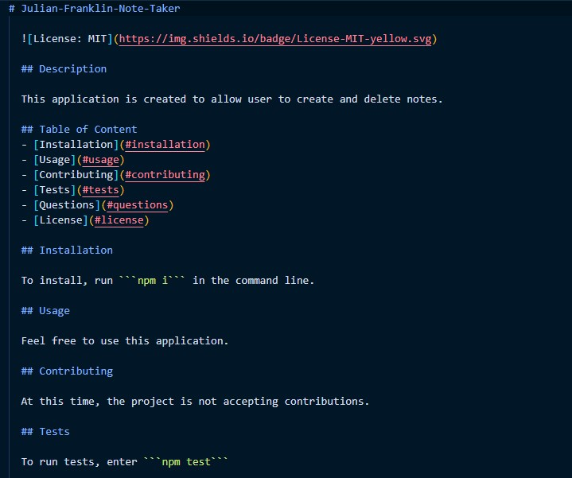

# Julian Franklin Professional README Generator

  

  ## Description
  
  This project is designed to allow users to create their own read me final using the integrated terminal in their project.

  

  

  [Creation of README Video](https://drive.google.com/file/d/1OX9IKHGp_kgQ9B41PQ3a5MMg-jOlVZID/view?usp=sharing)

  ## Table of Content
  - [Installation](#installation)
  - [Usage](#usage)
  - [Contributing](#contributing)
  - [Tests](#tests)
  - [Questions](#questions)
  - [License](#license)

  ## Installation

  To install, run ```npm i``` in the command line.

  ## Usage

  Feel free for use.

  ## Contributing

  This project is not accepting contriputions at this time.

  ## Tests
  
  To run tests, enter ```npm test```

  ## Questions

  If you have any questions, contact me at j.franks725@gmail.com. Visit my GitHub page at [jfranklin12](https://github.com/jfranklin12/) to see my other projects.

  ## Liscence
    
This projected is licensed under MIT.

  https://opensource.org/licenses/MIT
